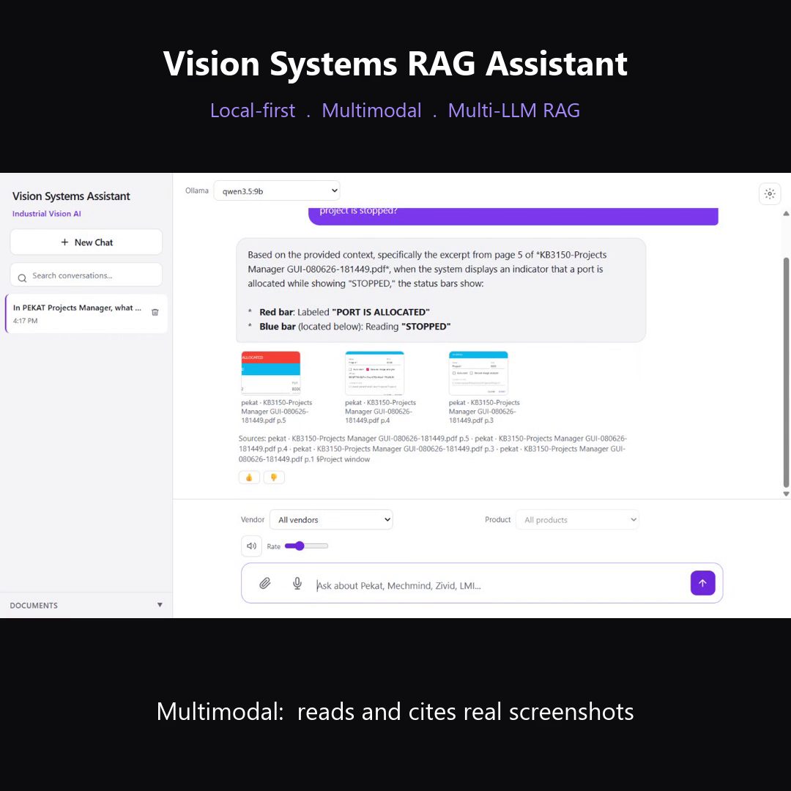

# Vision Systems Assistant (rag-agent)

A local-first **Retrieval-Augmented Generation (RAG)** assistant for industrial vision-systems documentation (Pekat, Mechmind, Zivid, LMI, and others). Ingest PDFs and HTML help articles into Qdrant, query them through a streaming chat UI, and optionally fall back to web search when local context is insufficient.

> **What this project demonstrates:** an end-to-end, production-shaped RAG system — not a notebook. Pluggable model/vector backends behind a provider factory, two API surfaces (REST + SSE and GraphQL + WebSocket subscriptions), a measurable retrieval pipeline (HyDE, cross-encoder rerank, semantic cache, web fallback), an offline eval harness with CI, and full observability — all backed by an automated test suite.

## Demo

[](rag-linkedin-demo.mp4)

A ~70-second local walkthrough ([download the MP4](rag-linkedin-demo.mp4)): grounded multimodal answers with cited screenshots, a product-video citation **playing inline**, live model switching across local Ollama models, and an **Ollama → Claude-subscription** provider switch — all running on-device.

## At a glance

| | |
|---|---|
| **Corpus indexed** | **59,762 chunks** — 46.4K text · 11.6K VLM image-captions · 1.7K product-video transcripts — across real vendor manuals, help-center HTML, and product videos (Pekat, LMI/Gocator, Mech-Mind, Zivid) in Qdrant |
| **Retrieval quality** | **recall@5 ≈ 0.93, MRR ≈ 0.80** on a 45-question golden set (text + image-caption) spanning all 4 vendors (see [Retrieval quality](#retrieval-quality)) |
| **Automated tests** | **527 passing** (`pytest`, +1 skipped), plus ruff lint + an offline retrieval/answer eval suite wired into CI |
| **Latency (local, 9B model)** | ~10 s end-to-end cold query (HyDE + 9B generation) · **~2.3 s on semantic-cache hit** · retrieve ≈ 20 ms · cross-encoder rerank ≈ 1.1 s (`RERANKER_FETCH_K=60`) |
| **Interfaces** | FastAPI + SSE streaming chat UI · GraphQL API with live `askStream` WebSocket subscription + React/Vite SPA |
| **Swappable backends** | LLM: Ollama / OpenAI / Anthropic / vLLM / VLM · Embed: Ollama / TEI / local GPU · Vectors: Qdrant local / sharded / cloud |
| **Retrieval techniques** | query condensation, HyDE, parallel orchestration, cross-encoder reranking, semantic cache, hybrid image retrieval, SearXNG web fallback |
| **Observability** | Langfuse v3 per-query traces · optional OpenTelemetry spans · production sampling for eval |

### Retrieval quality

Measured with the offline harness (`eval/run_retrieval_eval.py`) against **`eval/dataset.jsonl`** — 45 ground-truth questions (25 text + 20 image-caption) authored from real indexed chunks, each labelled with the exact source document(s) that contain the answer, spanning all four vendors (LMI/Gocator, Mech-Mind, Zivid, Pekat). Recall uses exact source-document matching. Shipping config: **dense + HyDE, `RERANKER_FETCH_K=60`** (sparse hybrid built but deferred — see caveats).

| Metric | Baseline (`eval/baseline.json`) |
|---|---|
| **recall@5** | **0.933** (42/45) |
| **recall@10** | 0.933 — every hit lands in the top 5 |
| **MRR** | **0.800** |
| image-caption recall@5 | 0.400 (multimodal is harder; reported separately) |
| mean top vector score | ≈ 0.74 |
| latency breakdown | embed ≈ 1.8 s (Ollama HyDE, the bottleneck) · Qdrant search ≈ 20 ms · cross-encoder rerank ≈ 1.1 s (`fetch_k=60`) |

This baseline is committed to `eval/baseline.json` so CI's `--check-baseline` flags genuine regressions without false alarms.

**Honest caveats:**
- **Run-to-run variance is real.** HyDE generates a hypothetical document with the LLM before embedding, which is non-deterministic, so recall@5 swings by ±1–2 questions across runs.
- **The golden set is small (45 Q).** A credible, representative sample — not a statistically large benchmark. Building it surfaced a useful finding: several "misses" were actually correct retrievals from a *different* file (the same answer appears across manual variants), which is why some questions accept multiple valid source documents.
- **Multimodal recall is lower by nature.** The 20 image-caption questions (VLM-captioned screenshots) retrieve their source document at ≈ 0.40 recall@5 — reported separately rather than folded into the headline.
- **Sparse hybrid is built but off.** A dense+sparse RRF path exists (`QDRANT_SPARSE_ENABLED`), but on this golden set it held recall@5 while *hurting* MRR (HyDE already closes the lexical gap it targets), so it ships disabled pending a better sparse text function — see [`REINGEST.md`](REINGEST.md).

## Features

- **Chat UI** — Dark-theme SPA with SSE streaming, conversation history, stop control, thumbs up/down feedback, optional dev analytics, and a documents panel (upload, ingest progress, delete).
- **GraphQL + React stack** — Standalone Strawberry GraphQL API (`graphql_app/`) exposing an `ask` query and an `askStream` **WebSocket subscription** for live token streaming, with a typed React + Vite + Apollo SPA (`frontend/`). Runs alongside the REST/SSE app, sharing the same retrieval pipeline via `rag_interface.py`.
- **Vendor/product scoping** — Toolbar dropdowns populated from `GET /vendors`; keyword inference from the question when filters are unset; explicit filters always win.
- **RAG pipeline** — Query condensation for follow-ups, HyDE, parallel `QueryOrchestrator`, cross-encoder reranking, semantic cache, sufficiency check, and SearXNG web fallback.
- **Ingest v2** — PDF + HTML (URL list or single URL), schema v2 Qdrant payloads, ingest manifest, collision-proof filenames, pending caption/video sidecars.
- **Provider abstraction** — Ollama (default LLM + embed), Claude / OpenAI / Gemini API keys, Claude subscription sign-in, local GPU or TEI embeddings, OpenAI-compatible chat endpoints (`vllm` / `tgi` / `openai_compatible`), optional VLM; Qdrant local, sharded, or cloud.
- **Cost optimization** (paid Claude path) — **model tiering** (Haiku for short HyDE/sufficiency calls, Sonnet for synthesis via `get_fast_llm()`), **prompt-cache-ready** system blocks, an offline **Batch API** path for eval/bulk at 50% cost, and **fewer billed Qdrant ops** (batched dense searches, cache-first, batched upserts). The default local Ollama path is unaffected.
- **Ops tooling** — `python -m scripts.ingest.reingest_all` (full-corpus re-ingest), `python -m scripts.ingest.extract_pdf_images` + `python -m scripts.ingest.caption_worker` (PDF/HTML image caption pipeline), `python -m scripts.ops.audit`, `python -m scripts.ops.cleanup`, eval suite with CI baseline checks.
- **Observability** — Langfuse v3 per-query analytics; optional OpenTelemetry spans.

## Architecture

### System overview

```
┌──────────────┐     ┌──────────────┐     ┌─────────────────────────────┐
│  Chat UI     │────▶│  FastAPI     │────▶│  providers/rag_pipeline.py  │
│  (SSE)       │     │  api/main.py │     │  plan → stream → analytics  │
└──────────────┘     └──────────────┘     └──────────────┬──────────────┘
                                                         │
                         ┌───────────────────────────────┼───────────────────────────────┐
                         ▼                               ▼                               ▼
              QueryOrchestrator                   GenerationPlan                    Langfuse
              (embed ∥ HyDE ∥ cache)              (prompt + citations)              + OTel
                         │
         ┌───────────────┼───────────────┬───────────────┬───────────────┐
         ▼               ▼               ▼               ▼               ▼
      Qdrant         Reranker        Redis cache      SearXNG         Ollama / vLLM
      vectors        (CrossEncoder)  (RedisVL opt.)   web search      LLM + embed
```

### Query path

1. **Optional condensation** — When chat history is non-empty, the LLM rewrites the follow-up into a standalone retrieval query (original question still goes to the generation prompt).
2. **Retrieval scope** — Explicit `vendor` / `product` from the UI or API; else single-vendor keyword detection on the (condensed) question; multiple vendor keywords → no filter (comparison queries). Zero filtered hits → unfiltered fallback (logged).
3. **Retrieval** — `QueryOrchestrator`: embed question (parallel with HyDE when enabled; HyDE runs on the cheaper fast tier), semantic cache lookup (skipped when history or filters are active), Qdrant search with payload filters (main + supplemental searches share one batched round-trip), optional hybrid image retrieval, rerank.
4. **Generation** — Sufficiency check (fast tier) and/or early web fallback; assemble prompt with history + chunk headers; stream LLM tokens; retry with web if answer is insufficient.

### Ingest path

```
PDF / HTML / TXT  →  read/split (producer thread)  →  chunk queue
                              ↓
                    embed batches (worker thread)
                              ↓
                    Qdrant upsert + doc_registry (main thread)
```

- **HTML** — BeautifulSoup extraction; Confluence pages prefer `.ak-renderer-document` when present (avoids SPA chrome). Heading-aware sections, image/video sidecars (`pending_captions.json`, `pending_videos.json`).
- **Incremental** — `data/ingest_manifest.json` tracks SHA-256 per source; unchanged files skip re-embed unless `--force`.
- **Metadata** — Upload modal and CLI flags set vendor, product, doc type, version, URL.

### Key modules

| Module | Role |
|--------|------|
| `providers/rag_pipeline.py` | RAG orchestration, condensation, filters, prompt assembly, SSE events |
| `providers/query_orchestrator.py` | Parallel embed / HyDE (fast tier) / cache / batched search / rerank |
| `scripts/ingest/ingest.py` | v2 ingest pipeline, manifest, HTML loader |
| `providers/factory.py` | Provider singletons (`get_llm`, `get_fast_llm`, embed, store, cache, reranker) |
| `providers/anthropic_batch.py` | Offline Anthropic Batch API (bulk/eval at 50% cost) |
| `providers/metadata.py` | Vendor inference, chunk IDs, upload metadata |
| `scripts/ops/audit.py` | Read-only Qdrant coverage vs manifest (`python -m scripts.ops.audit`) |
| `scripts/ops/cleanup.py` | Delete or retag sources by `payload.source` (`python -m scripts.ops.cleanup`) |
| `scripts/ingest/reingest_all.py` | Resumable full-corpus re-ingest (`python -m scripts.ingest.reingest_all`) |
| `scripts/ingest/extract_pdf_images.py` | Extract embedded PDF images → caption queue (`python -m scripts.ingest.extract_pdf_images`) |
| `scripts/ingest/caption_worker.py` | Vision-caption queued images → `image_caption` points (`python -m scripts.ingest.caption_worker`) |
| `scripts/ingest/ingest_worker.py` | Redis ingest queue consumer (`python -m scripts.ingest.ingest_worker`) |
| `scripts/ingest/video_frame_worker.py` | Scene-change video frame captions (`python -m scripts.ingest.video_frame_worker`) |
| `scripts/mechmind_batch_ingest.py` | One-off Mech-Mind PDF batch (`python -m scripts.mechmind_batch_ingest`) |
| `scripts/zivid_batch_ingest.py` | One-off Zivid PDF batch (`python -m scripts.zivid_batch_ingest`) |
| `scripts/backfill_manifest.py` | Manifest backfill for legacy Qdrant sources (`python -m scripts.backfill_manifest`) |
| `eval/` | Offline retrieval and answer evaluation |

> **Note:** Deep design notes and agent context live in local-only `ARCHITECTURE.md` / `CLAUDE.md` (gitignored).

## Document metadata (schema v2)

Each Qdrant point payload includes:

| Field | Description |
|-------|-------------|
| `text` | Chunk content (or preview + `text_uri` when blob storage enabled) |
| `source` | Filename only (e.g. `manual-abc12345.html`) |
| `vendor` | Lowercase vendor slug |
| `product` | Product line (e.g. `gocator`, `pekat vision`, `hexsight`) |
| `product_version` | Optional software/firmware version |
| `doc_type` | `manual`, `article`, `datasheet`, `tutorial`, etc. |
| `page` | PDF page (0-based); `null` for HTML |
| `section` | Heading label when detected |
| `url` | Original article URL for HTML ingests |
| `content_type` | `text` or `image_caption` (vision-captioned figures) |
| `schema_version` | `2` |
| `ingested_at` | ISO-8601 UTC timestamp |

Citations returned to the UI include `source`, `vendor`, `page`, `section`, and scores when available.

### Retrieval scoping

| Mechanism | When | Cache |
|-----------|------|-------|
| **Explicit** | UI vendor/product dropdowns or API `vendor` / `product` | Skipped |
| **Keyword** | Question mentions one known vendor (no explicit filter) | Skipped |
| **None** | No filter, or multiple vendors in question | Normal |

Filter precedence is logged as `filter_mechanism`: `explicit`, `keyword`, or `none` (Langfuse + dev analytics).

## Project structure

```
rag-agent/
├── api/main.py                 # FastAPI: /query, /upload, /vendors, /documents, sessions
├── ui/index.html               # Chat UI (vanilla JS, no build step)
├── providers/rag_pipeline.py   # RAG query pipeline
├── scripts/ingest/ingest.py    # Ingest v2 (PDF, HTML, URL, VTT modes)
├── config/
│   ├── vendors.json            # Vendor folders, YouTube channel aliases
│   └── searxng/settings.yml    # SearXNG instance config
├── providers/                  # LLM, embed, Qdrant, cache, reranker, orchestrator, …
├── scripts/
│   ├── ingest/                 # ingest, reingest, caption_worker, ingest_video, …
│   ├── ops/                    # audit, cleanup, migrate_*, backfill_doc_registry
│   ├── data/                   # download_docs, fetch_lmi_urls
│   └── backfill_manifest.py    # Manifest backfill for legacy Qdrant sources
├── eval/                       # Retrieval/answer eval, CI baseline
├── tests/                      # Unit tests (see tests/TESTING.md)
├── data/                       # Runtime: uploads, manifest, registries (gitignored)
├── logs/                       # Operational logs (gitignored)
├── docs/                       # Vendor manuals + internal notes (content gitignored)
├── docker-compose.yml          # qdrant, redis, searxng, api, langfuse stack
└── Dockerfile                  # API container image
```

## Prerequisites

- **Python 3.11+** with a virtual environment
- **Ollama** on the host (`ollama serve`) for default LLM and embeddings
- **Docker** for Qdrant, Redis, SearXNG, and optional Langfuse

```powershell
ollama pull qwen3.5:9b
ollama pull qwen3-embedding:0.6b
ollama pull llava:7b
```

Default stack: **LLM** `qwen3.5:9b`, **embed** `qwen3-embedding:0.6b` (1024-dim), **vision** `llava:7b` for image captions. Set `OLLAMA_THINK_ENABLED=false` for qwen3.x RAG (see `.env.example`).

## Installation

```powershell
git clone https://github.com/charbelfakh/rag-agent.git
cd rag-agent
python -m venv .venv
.venv\Scripts\activate
pip install -r requirements.txt
copy .env.example .env
```

## Configuration

Copy `.env.example` to `.env`. Common variables:

| Variable | Description | Default |
|----------|-------------|---------|
| `LLM_PROVIDER` | `ollama`, `anthropic`, `openai`, `gemini`, `claude_subscription`, `vllm`, `openai_compatible`, `tgi`, `vlm` | `ollama` |
| `LLM_FAST_MODEL` | Cheap "fast tier" for HyDE/sufficiency (`anthropic` only; else main model) | `claude-haiku-4-5` |
| `EMBED_PROVIDER` | `ollama`, `gpu`, `tei` | `ollama` |
| `VECTOR_STORE` | `qdrant_local`, `qdrant_cloud` | `qdrant_local` |
| `QDRANT_COLLECTION` | Collection name | `rag_docs` |
| `HYDE_ENABLED` | Hypothetical document embeddings | `true` |
| `RERANKER_ENABLED` | Cross-encoder reranking | `true` |
| `SEMANTIC_CACHE_ENABLED` | Redis-backed answer cache | `true` |
| `ANALYTICS_ENABLED` | Langfuse query logging | `true` |
| `API_KEY` | Optional `X-API-Key` auth (unset = disabled) | — |
| `CHAT_HISTORY_TURNS` | Messages in LLM prompt | `6` |

See `.env.example` for the full list (orchestrator flags, blob storage, sharding, multimodal, etc.).

## Running locally

```powershell
docker compose up -d qdrant redis searxng
ollama serve
python api/main.py
```

Open **http://localhost:8000**. Hard-refresh after UI changes.

### Ingest

```powershell
# PDF
python -m scripts.ingest.ingest data/pekat/manual.pdf --vendor pekat --doc-type manual

# HTML from URL list
python -m scripts.ingest.ingest --url-list data/lmi/urls_kb.txt --vendor lmi --doc-type article --product gocator

# UI: Documents panel → upload with metadata modal
```

### Full corpus re-ingest (LMI + Pekat)

Resumable pipeline: text ingest → PDF image extraction → vision caption drain → report.

```powershell
# Dry-run first
python -m scripts.ingest.reingest_all --vendors lmi pekat --dry-run

# Full run (GPU-heavy during caption phase — avoid concurrent chat queries)
python -m scripts.ingest.reingest_all --vendors lmi pekat

# Or run stages individually:
python -m scripts.ingest.extract_pdf_images --all
python -m scripts.ingest.caption_worker --vendor lmi --reconcile-missing -v
python -m scripts.ingest.caption_worker --vendor pekat -v
```

State is saved to `data/reingest_state.json`; reports go to `reingest_report_*.md` (both gitignored).

### Vendor doc downloads

```powershell
python -m scripts.data.download_docs --list
python -m scripts.data.download_docs --vendor pekat
```

### Audit and cleanup

```powershell
python -m scripts.ops.audit --detail --vendor lmi
python -m scripts.ops.audit --json logs/audits/report.json

python -m scripts.ops.cleanup --dry-run --delete-sources data/lmi/sources_to_delete.txt
python -m scripts.ops.cleanup --retag data/lmi/sources_to_retag.txt --product hexsight --yes
```

## API endpoints

| Method | Path | Description |
|--------|------|-------------|
| `GET` | `/` | Chat UI |
| `GET` | `/health` | Health check |
| `GET` | `/health/embed` | Embedder health |
| `GET` | `/vendors` | Distinct vendor/product pairs (5 min cache; `?refresh=true`) |
| `POST` | `/query` | SSE stream (`token`, `citations`, `done`, `meta`) |
| `GET` | `/documents` | List ingested sources |
| `POST` | `/upload` | Upload file → ingest job |
| `GET` | `/ingest/status/{job_id}` | Ingest progress |
| `POST` | `/ingest` | Ingest by server path |
| `DELETE` | `/ingest` | Delete chunks by source |
| `POST` | `/feedback` | Thumbs up/down → Langfuse |
| `GET` | `/sessions` | List sessions (when `SESSION_STORAGE_ENABLED`) |

When `API_KEY` is set, send `X-API-Key` on protected routes.

### `POST /query` body

```json
{
  "question": "How does surface flatness work?",
  "top_k": 10,
  "history": [],
  "vendor": "pekat",
  "product": null
}
```

Omit `vendor` and `product` when using “All vendors” / “All products” in the UI.

## Observability

Enable Langfuse:

```env
ANALYTICS_ENABLED=true
LANGFUSE_PUBLIC_KEY=pk-lf-...
LANGFUSE_SECRET_KEY=sk-lf-...
LANGFUSE_HOST=http://localhost:3000
```

```powershell
docker compose up -d langfuse-web langfuse-worker langfuse-postgres langfuse-clickhouse langfuse-minio langfuse-redis
```

Dev analytics in the UI: **Settings → Show query analytics**.

### Offline eval

```powershell
python eval/run_retrieval_eval.py
python eval/run_retrieval_eval.py --write-baseline
python eval/run_retrieval_eval.py --check-baseline
python eval/run_answer_eval.py
python eval/run_answer_eval.py --batch   # grade the whole set in one Anthropic Batch API job (50% cost)

# Caption ablation (text-only vs full corpus)
python eval/run_retrieval_eval.py --dataset eval/dataset_caption.jsonl --content-type-filter text
python eval/run_retrieval_eval.py --dataset eval/dataset_caption.jsonl --content-type-filter none
```

CI runs unit tests and baseline checks via `.github/workflows/eval.yml`.

## Tests

```powershell
pip install -r requirements-dev.txt
python -m pytest tests/ -q
```

**528 tests** across sprints A–Q, the cost-optimization increment, API endpoints, ingest v2, caption worker, and coverage audit. Requires `pytest-asyncio` (included in `requirements-dev.txt`). Policy: new modules, env knobs, and API routes need tests in the same change ([tests/TESTING.md](tests/TESTING.md)).

## Roadmap

### Shipped (current)

| Area | Capability |
|------|------------|
| **Core RAG** | HyDE, reranker, semantic cache, web fallback, sufficiency check, early web fallback |
| **Cost** | LLM model tiering (Haiku HyDE/sufficiency), cached system blocks, offline Batch API (50%), batched Qdrant searches |
| **Query UX** | Multi-turn history, query condensation, vendor/product filters + keyword inference |
| **Ingest** | Schema v2, HTML/URL ingest, Confluence `.ak-renderer-document` extraction, manifest, upload metadata, incremental skip |
| **Scale** | Parallel orchestrator, ingest queue + workers, blob externalization, vendor sharding |
| **Quality** | Section-aware chunking, map-reduce retrieval, speculative generation, dynamic rerank top-N |
| **Multimodal** | PDF image extract, vision captions (`image_caption` points), hybrid retrieval stubs, ColPali/VLM stubs |
| **Ops** | `scripts/ops/*`, `scripts/ingest/*`, `scripts/data/*`, Langfuse + OTel |
| **UI** | Documents panel, upload modal, vendor/product toolbar, feedback buttons, markdown rendering |

### Next (prioritized)

| Priority | Item | Notes |
|----------|------|-------|
| 1 | **Remaining vendor ingest** | Photoneo, Basler, etc. — deferred by choice |
| 2 | **KB3150 Mask + ML Training visuals** | Shell print-to-PDFs have no extractable images; needs proper Confluence PDF export (cf. KB3150-Detector) |
| 3 | **Typo-tolerant vendor keywords** | e.g. `pekt` → `pekat` for inference |
| 4 | **Server-side sessions by default** | `SESSION_STORAGE_ENABLED` exists; UI still uses `localStorage` for conversations |
| 5 | **Scheduled doc refresh** | Cron/worker around `python -m scripts.data.download_docs` + URL lists per vendor |
| 6 | **ColPali / diagram PDF index** | Stub embedder present; needs end-to-end ingest + retrieval |
| 7 | **GoPxL caption disambiguation** | Same-family manuals share figure captions; enrich with `product`/`device_family` metadata |

### Later / experimental

- Cross-encoder cache for repeated retrieval patterns
- Automated golden-set expansion from production sampling (`eval/production_sampler.py`)
- Multi-tenant API keys and per-tenant collections
- Hosted deployment guide (Qdrant Cloud + GPU embed sidecar)

## Optional feature flags (quick reference)

Enable via `.env` — each has tests in `tests/test_sprint_*.py`:

```env
# Retrieval
QUERY_ORCHESTRATOR_ENABLED=true
TWO_STAGE_RETRIEVAL_ENABLED=true
HYBRID_RETRIEVAL_ENABLED=true
MAP_REDUCE_RETRIEVAL_ENABLED=true
SPECULATIVE_GENERATION_ENABLED=true

# Ingest / storage
INGEST_QUEUE_ENABLED=true
BLOB_STORAGE_ENABLED=true
MULTIMODAL_IMAGE_INGEST_ENABLED=true
QDRANT_VENDOR_SHARDING=true

# Cache
SEMANTIC_CACHE_BACKEND=redisvl

# Cost (paid Claude path)
LLM_FAST_MODEL=claude-haiku-4-5      # HyDE/sufficiency tier on LLM_PROVIDER=anthropic
LLM_FAST_MAX_TOKENS=512

# Infra
OTEL_ENABLED=true
SESSION_STORAGE_ENABLED=true
```

See `.env.example` for defaults and Docker Compose profiles (`workers`, `gpu-embed`, `vllm-pool`, `multimodal`).

## Known limitations

- **Ollama on host** — Not in Docker; `[WinError 10061]` means Ollama is not running on port 11434.
- **Client-side chat history** — Conversations default to browser `localStorage` unless session storage is enabled.
- **Semantic cache** — Skipped when chat history or vendor/product filters are active.
- **Large ingests** — Full vendor corpora (e.g. 270 LMI articles) take significant time on local Ollama embed.
- **Web fallback** — Quality depends on SearXNG instance and upstream engines; not vendor-scoped.
- **Corpus gaps** — Strong retrieval cannot answer topics absent from ingested docs. Some Pekat KB3150 PDFs are print-to-PDF shells (text-only, no figures); captioning cannot recover missing screenshots.
- **GPU contention** — On 8 GB cards, do not run `python -m scripts.ingest.caption_worker` concurrently with live chat queries (vision + LLM + embed compete for VRAM).

## Troubleshooting

| Symptom | Likely cause | Fix |
|---------|--------------|-----|
| `[WinError 10061]` | Ollama not running | `ollama serve` |
| `401 Unauthorized` | `API_KEY` set, key missing in UI | Settings → API key |
| Mixed vendor citations | No filter; comparison or broad topic | Set vendor dropdown or mention one vendor |
| “Insufficient” with on-topic chunks | Topic not in vendor corpus | Ingest missing docs or query correct vendor |
| Stale answers | Semantic cache | `redis-cli DEL semantic_cache:entries` |
| UI changes invisible | Browser cache | Hard refresh (Ctrl+Shift+R) |

## License

See [LICENSE](LICENSE).
